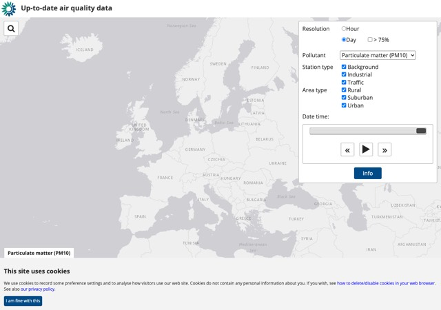
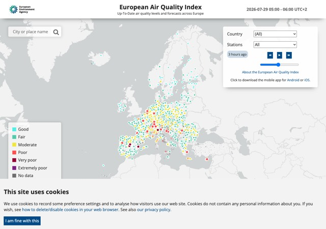

# Air quality now

*Source: [https://aqportal.discomap.eea.europa.eu/air-quality-now/](https://aqportal.discomap.eea.europa.eu/air-quality-now/)*

**UTD viewer**

The UpToDate or UTD data are presented in near real time in this map viewer.

Direct link: <https://discomap.eea.europa.eu/Map/UTDViewer/UTDViewer/>

**Air Quality Index**

This is the viewer dedicated to the European Air Quality Index based on the UTD data for NO2, PM2.5/PM10, O3 and SO2.

Direct link: <https://airindex.eea.europa.eu/AQI/index.html>

<!-- gallery:start - generated by scripts/build_gallery.py, do not edit -->

## Viewers in this section

2 interactive applications. Each opens in a new tab; see [all viewers and dashboards](../viewers/index.md) for the full catalogue.

<a class="app-card" href="https://discomap.eea.europa.eu/Map/UTDViewer/UTDViewer/">Up-To-Date viewer (UTD)</a>
<a class="app-card" href="https://airindex.eea.europa.eu/AQI/index.html">Air Quality Index</a>

<!-- gallery:end -->
