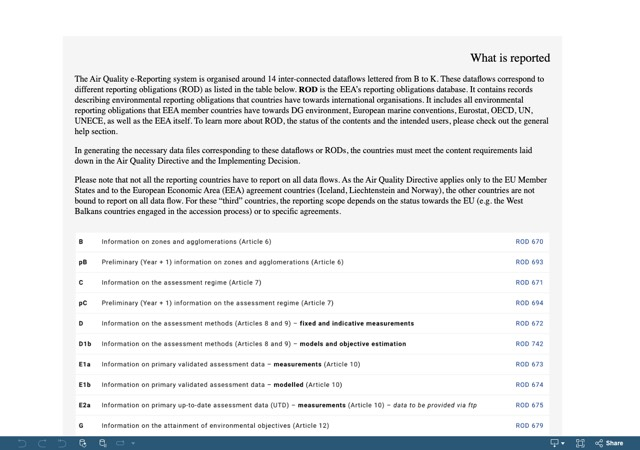
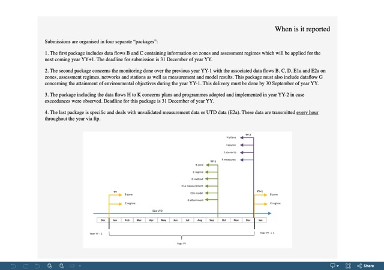
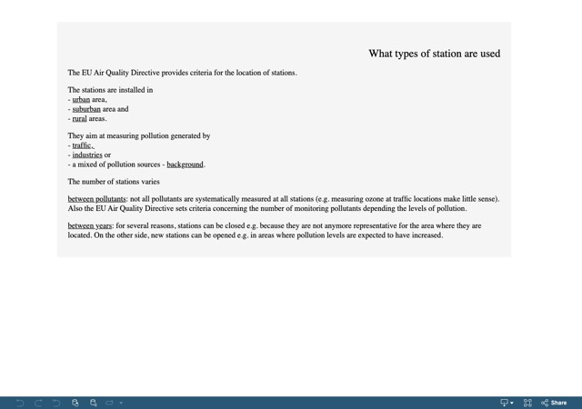
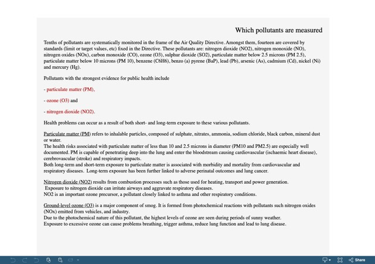
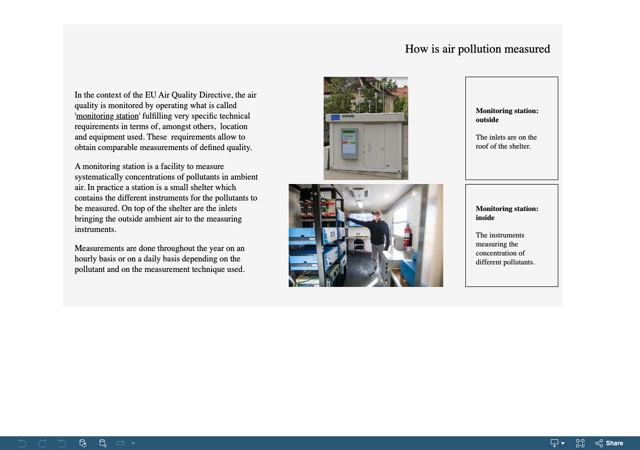
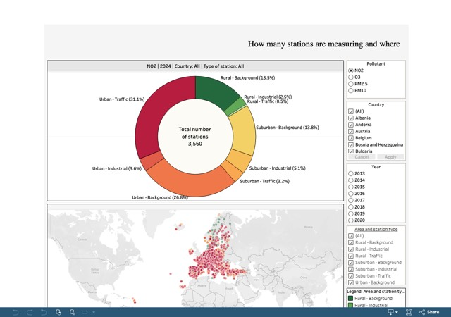
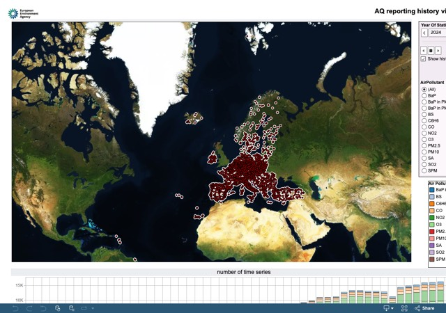

# AQ eReporting

Air Quality eReporting provides the framework through which European countries submit information on ambient air quality to the European Environment Agency (EEA). It covers monitoring networks, assessment methods, measured and modelled concentrations, compliance information, air quality plans and related documentation.

## Legal basis

Air Quality eReporting was established under [Directive 2008/50/EC](https://eur-lex.europa.eu/legal-content/EN/TXT/?uri=CELEX:32008L0050) on ambient air quality and cleaner air for Europe. It continues and extends the reciprocal exchange of air quality information introduced under earlier European legislation.

The reporting framework also supports the obligations established under [Directive 2004/107/EC](https://eur-lex.europa.eu/legal-content/EN/TXT/?uri=CELEX:32004L0107), concerning arsenic, cadmium, mercury, nickel and polycyclic aromatic hydrocarbons in ambient air. Both directives were subsequently amended by [Commission Directive (EU) 2015/1480](https://eur-lex.europa.eu/legal-content/EN/TXT/?uri=CELEX:32015L1480).

Directive 2008/50/EC establishes the general obligation for Member States to make air quality information available to the European Commission. It also provides for implementing measures defining:

- the information to be reported;
- the applicable reporting deadlines;
- the formats and encoding rules to be used; and
- arrangements for streamlining the exchange of information from air quality monitoring networks and stations.

These technical and practical arrangements were established through [Commission Implementing Decision 2011/850/EU](https://eur-lex.europa.eu/legal-content/EN/TXT/?uri=CELEX:32011D0850), commonly known as the **IPR Decision**.

## How the reporting system works

The IPR Decision defines the nature and content of the information to be submitted, together with the required data formats, encoding conventions and reporting schedules.

In practice, Air Quality eReporting supports the exchange of information on:

- air quality zones and assessment regimes;
- monitoring stations and sampling points;
- measurement and modelling methods;
- pollutant concentrations;
- compliance with legal objectives;
- air quality plans, scenarios and measures; and
- supporting technical documentation.

## Explore AQ eReporting

The interactive applications below provide an introduction to the reporting system, including what is reported, when reporting takes place, which pollutants and monitoring stations are involved, and how the system has evolved over time.  
Each opens in a new tab. 

<!-- gallery:start - generated by scripts/build_gallery.py, do not edit -->

<a class="app-card" href="https://tableau-public.discomap.eea.europa.eu/views/AQeRep_for_public_for_portal/Whatisreported">What is reported</a>
<a class="app-card" href="https://tableau-public.discomap.eea.europa.eu/views/AQeRep_for_public_for_portal/Whenisitreported">When is it reported</a>
<a class="app-card" href="https://tableau-public.discomap.eea.europa.eu/views/AQeRep_for_public_for_portal/Whattypeofstations">What types of stations are used</a>
<a class="app-card" href="https://tableau-public.discomap.eea.europa.eu/views/AQeRep_for_public_for_portal/Whichpollutantsaremeasured">Which pollutants are measured</a>
<a class="app-card" href="https://tableau-public.discomap.eea.europa.eu/views/AQeRep_for_public_for_portal/Howisairpollutionmeasured">How is air pollution measured</a>
<a class="app-card" href="https://tableau-public.discomap.eea.europa.eu/views/AQeRep_for_public_for_portal/Howmanystationsaremeasuring">How many stations are measuring and where</a>
<a class="app-card" href="https://tableau-public.discomap.eea.europa.eu/views/AQReportingHistory/Dashboard1">Evolution of AQ Reporting over the years</a>

<!-- gallery:end -->