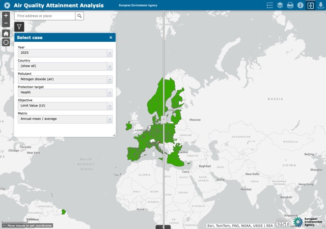
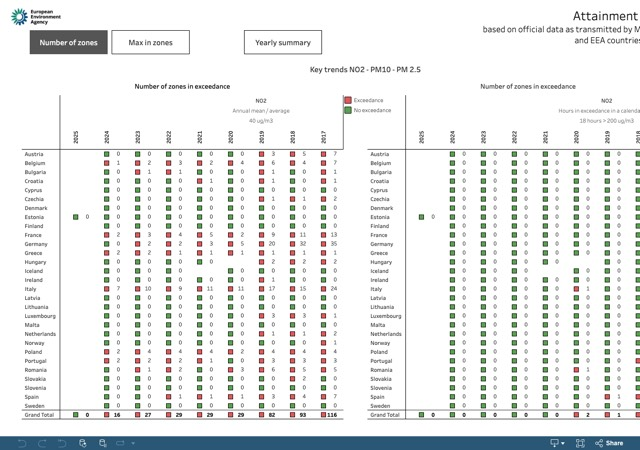
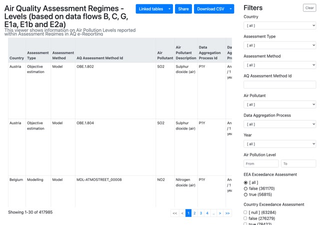
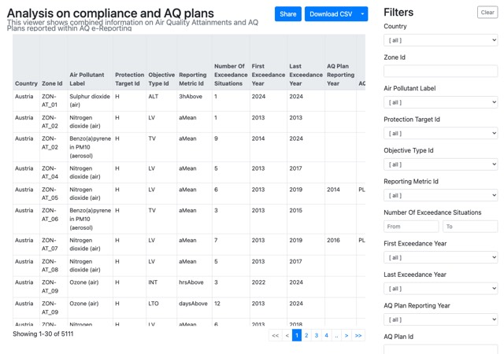
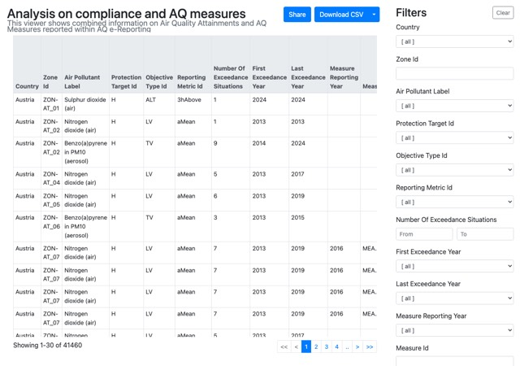

# Compliance status

*Source: [https://aqportal.discomap.eea.europa.eu/compliance-status/](https://aqportal.discomap.eea.europa.eu/compliance-status/)*

**Attainment map viewer**

This viewer presents the same information as in the attainment viewer above but using a map display. Details are accessible through the tooltips.

Direct link: <https://maps.eea.europa.eu/wab/AttainmentViewer/>

**Attainment summary**

Key trends of the number of zones and the maximum value recorded in exceedance for NO2, PM2.5 and PM10 throughout the years are presented in this viewer. It also includes a general table showing the number of zones in exceedance for all pollutants on a yearly basis. This viewer is based on the information transmitted officially by the Member States in their G data flow.

Direct link: <https://tableau-public.discomap.eea.europa.eu/views/attainment_summary_ng/Numberofzones>

**Attainment general**

The detailed attainment status of the zones declared by the Member States is presented in this viewer.

The main table presents the max value observed in the reported zone together with the status (exceedance or no exceedance) as reported by the Member States in their G dataflow . The same information but based on the values calculated by the EEA on the basis of the data reported in E1a (and E2a) and E1b (models) is also included.

Additional tables and graphs are also presented in this viewer.

**11/09/2024: new version**

Direct link: <https://tableau-public.discomap.eea.europa.eu/views/attainment_ng/Master>

**B/C/pC/E1a/E1b/E2a – assessment regimes – levels**

Information on air pollution levels reported within assessment regimes in AQ e-Reporting is presented in this table viewer. It is based on data flows E1a, E1b, C, B, E2a, and preliminary C.

Direct link: <https://discomap.eea.europa.eu/App/AQViewer/index.html?fqn=Airquality_Dissem.complanalysis.AssessmentRegimeLevels>

**G/H** **– compliance and plans**

Combined information on Air Quality Attainments and AQ Plans reported within AQ e-Reporting. It is based on data flows G and H.

Direct link: <https://discomap.eea.europa.eu/App/AirQualityExceedingGroupsAndPlans/index.html#>

**G/K – compliance and measures**

Combined information on Air Quality Attainments and AQ Measures reported within AQ e-Reporting. It is based on data flows G and K.

Direct link: https://discomap.eea.europa.eu/App/AirQualityExceedingGroupsAndMeasures/index.html#

<!-- gallery:start - generated by scripts/build_gallery.py, do not edit -->

## Viewers in this section

5 interactive applications. Each opens in a new tab; see [all viewers and dashboards](../viewers/index.md) for the full catalogue.

<a class="app-card" href="https://maps.eea.europa.eu/wab/AttainmentViewer/">Attainment map viewer</a>
<a class="app-card" href="https://tableau-public.discomap.eea.europa.eu/views/attainment_summary_ng/Numberofzones">Attainment summary</a>
<a class="app-card" href="https://discomap.eea.europa.eu/App/AQViewer/index.html?fqn=Airquality_Dissem.complanalysis.AssessmentRegimeLevels">B/C/pC/E1a/E1b/E2a - Assessment regimes - levels</a>
<a class="app-card" href="https://discomap.eea.europa.eu/App/AirQualityExceedingGroupsAndPlans/index.html#">G/H - compliance &amp; plans</a>
<a class="app-card" href="https://discomap.eea.europa.eu/App/AirQualityExceedingGroupsAndMeasures/index.html#">G/K - compliance &amp; measures</a>

<!-- gallery:end -->
