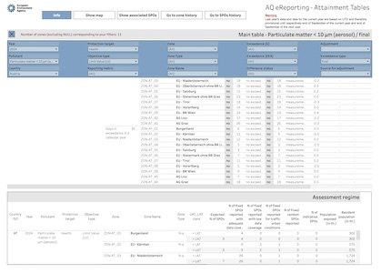

# Compliance status

These applications support the assessment of compliance with the Ambient Air Quality Directives. They provide access to reported attainment status, trends over time, supporting assessment information, and links between exceedances, air quality plans and measures.

## Compliance overview

```{list-table}
:widths: 60 40
:class: viewer-list-table

* - ### Attainment map

    Explore the reported attainment status across Europe using an interactive map. Detailed information for each zone is available through the map tooltips.

    [**Open interactive viewer**](https://maps.eea.europa.eu/wab/AttainmentViewer/)

  - [](https://maps.eea.europa.eu/wab/AttainmentViewer/)

    *Click the image to open the interactive viewer.*

* - ### Attainment summary

    Review yearly trends in the number of zones in exceedance together with the maximum reported concentrations for the main regulated pollutants. The viewer is based on the official attainment information reported by Member States through data flow G.

    [**Open interactive viewer**](https://tableau-public.discomap.eea.europa.eu/views/attainment_summary_ng/Numberofzones)

  - [](https://tableau-public.discomap.eea.europa.eu/views/attainment_summary_ng/Numberofzones)

    *Click the image to open the interactive viewer.*

* - ### Detailed attainment status

    Examine the detailed attainment status reported for each air quality zone, including reported exceedances, calculated concentrations and supporting tables and charts.

    [**Open interactive viewer**](https://tableau-public.discomap.eea.europa.eu/views/attainment_ng/Master)

  - [](https://tableau-public.discomap.eea.europa.eu/views/attainment_ng/Master)

    *Click the image to open the interactive viewer.*
```

## Supporting assessment

```{list-table}
:widths: 60 40
:class: viewer-list-table

* - ### Assessment regimes and pollution levels

    Explore the assessment regimes together with the reported pollution levels used to determine compliance. The viewer combines information from data flows B, C, preliminary C, E1a, E1b and E2a.

    [**Open interactive viewer**](https://discomap.eea.europa.eu/App/AQViewer/index.html?fqn=Airquality_Dissem.complanalysis.AssessmentRegimeLevels)

  - [](https://discomap.eea.europa.eu/App/AQViewer/index.html?fqn=Airquality_Dissem.complanalysis.AssessmentRegimeLevels)

    *Click the image to open the interactive viewer.*
```

## Follow-up actions

```{list-table}
:widths: 60 40
:class: viewer-list-table

* - ### Compliance and air quality plans

    Identify exceedance zones together with the corresponding air quality plans reported by Member States through data flows G and H.

    [**Open interactive viewer**](https://discomap.eea.europa.eu/App/AirQualityExceedingGroupsAndPlans/index.html#)

  - [](https://discomap.eea.europa.eu/App/AirQualityExceedingGroupsAndPlans/index.html#)

    *Click the image to open the interactive viewer.*

* - ### Compliance and measures

    Review the measures reported by Member States to address exceedances by combining information from data flows G and K.

    [**Open interactive viewer**](https://discomap.eea.europa.eu/App/AirQualityExceedingGroupsAndMeasures/index.html#)

  - [](https://discomap.eea.europa.eu/App/AirQualityExceedingGroupsAndMeasures/index.html#)

    *Click the image to open the interactive viewer.*
```