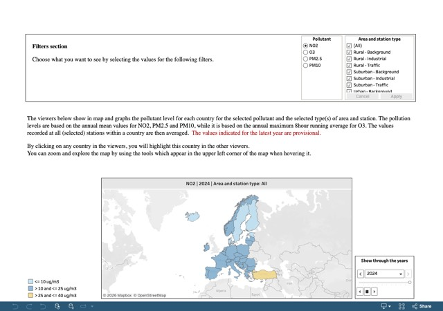
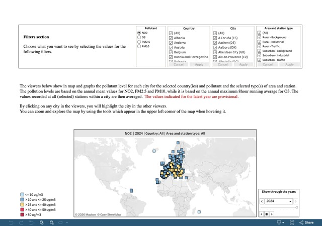
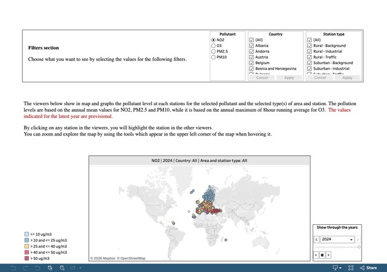
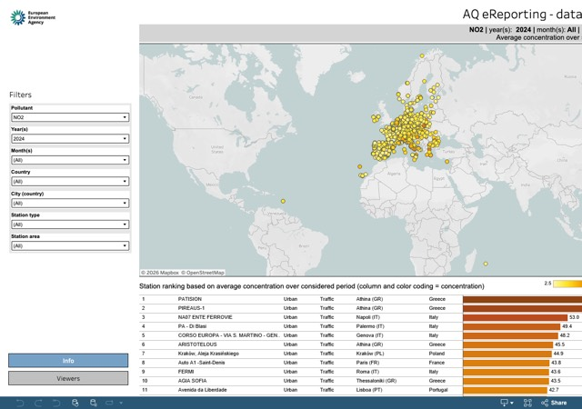
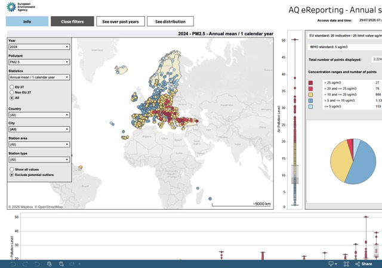
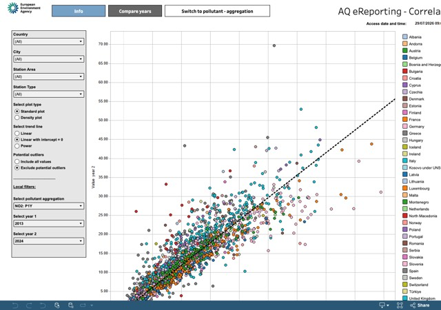
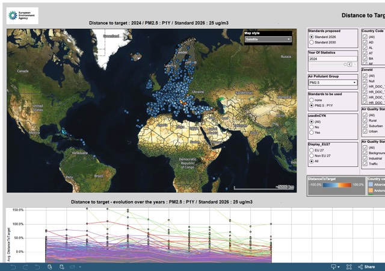
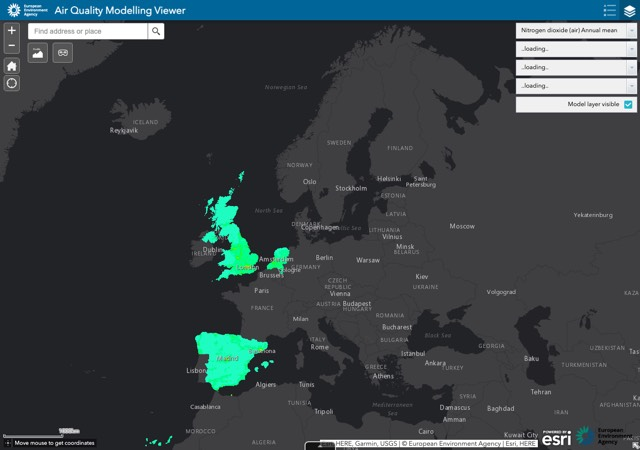

# Data analysis and stats

*Source: [https://aqportal.discomap.eea.europa.eu/data-analysis-and-stats/](https://aqportal.discomap.eea.europa.eu/data-analysis-and-stats/)*

Data & statistics

**Statistics – country / city / station levels**

These viewers give a **quick overview of the air pollution levels** for Particulate Matter (PM10 and PM2.5), Nitrogen Dioxide (NO2) and Ozone (O3) as transmitted by the participating countries to the EEA in the frame of AQ eRep..

The results are presented:

- at the **country level**: the values are averaged on all measuring stations – direct link: <https://tableau-public.discomap.eea.europa.eu/views/AQeRep_for_public_for_portal/Countrydashboard>
- at the **city level**: the values are averaged over all the measuring stations located within in the city – direct link: <https://tableau-public.discomap.eea.europa.eu/views/AQeRep_for_public_for_portal/Citydashboard>
- at the **station level** – direct link: <https://tableau-public.discomap.eea.europa.eu/views/AQeRep_for_public_for_portal/Stationdashboard>

**Daily – weekly – monthly viewer**

The evolution throughout the year(s) of the daily, weekly or monthly air pollution concentrations can be followed with this viewer at station level. Stations are also ranked according to their level of pollution.

Direct link: <https://tableau-public.discomap.eea.europa.eu/views/data_viewer_ng/Home>

**General statistical viewer**

This is the general statistical viewer. It covers all pollutants and all aggregations. Results are presented by year on maps and box plots. Specific screens also show the evolution throughout the years as well as the distribution of the values.

Direct link: <https://tableau-public.discomap.eea.europa.eu/views/statistical_ng/General>

**Correlation tool**

The correlation tool allows to compare different air pollutant/aggregations for the same year(s) or two different years for the same pollutant/aggregation.

Direct link: <https://tableau-public.discomap.eea.europa.eu/views/correlation_tool_ng/Compareyears>

**Distance to target viewer**

This viewer presents the distance to target for the standards 2026 and the standards which will apply from 2030 onwards.

Direct link: <https://tableau-public.discomap.eea.europa.eu/views/DistanceToTarget/Dashboarddistancetotarget>

Models

**Modelling results**

The results from models transmitted by the Member States are presented here.

Direct link: <https://discomap.eea.europa.eu/AirQualityModellingViewer/>

<!-- gallery:start - generated by scripts/build_gallery.py, do not edit -->

## Viewers in this section

8 interactive applications. Each opens in a new tab; see [all viewers and dashboards](../viewers/index.md) for the full catalogue.

<a class="app-card" href="https://tableau-public.discomap.eea.europa.eu/views/AQeRep_for_public_for_portal/Countrydashboard">Statistics - country level</a>
<a class="app-card" href="https://tableau-public.discomap.eea.europa.eu/views/AQeRep_for_public_for_portal/Citydashboard">Statistics - city level</a>
<a class="app-card" href="https://tableau-public.discomap.eea.europa.eu/views/AQeRep_for_public_for_portal/Stationdashboard">Statistics - station level</a>
<a class="app-card" href="https://tableau-public.discomap.eea.europa.eu/views/data_viewer_ng/Home">Daily-weekly-monthly data</a>
<a class="app-card" href="https://tableau-public.discomap.eea.europa.eu/views/statistical_ng/General">General statistical viewer</a>
<a class="app-card" href="https://tableau-public.discomap.eea.europa.eu/views/correlation_tool_ng/Compareyears">Correlation tool</a>
<a class="app-card" href="https://tableau-public.discomap.eea.europa.eu/views/DistanceToTarget/Dashboarddistancetotarget">Distance to target</a>
<a class="app-card" href="https://discomap.eea.europa.eu/AirQualityModellingViewer/">Modelling results - maps</a>

<!-- gallery:end -->
