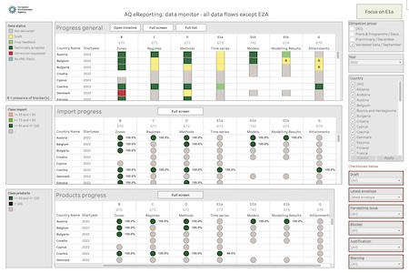
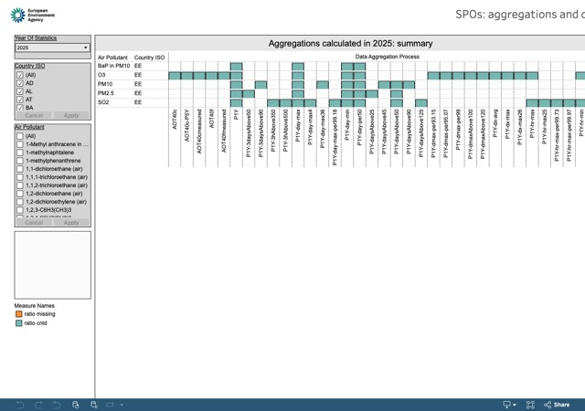
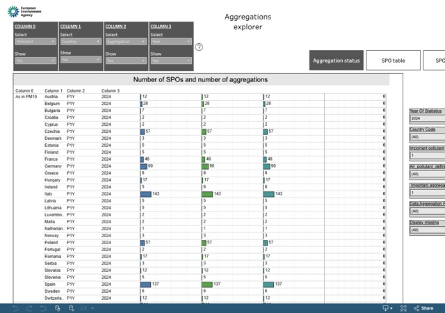
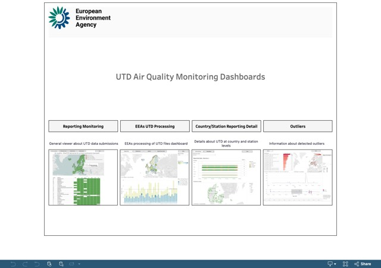
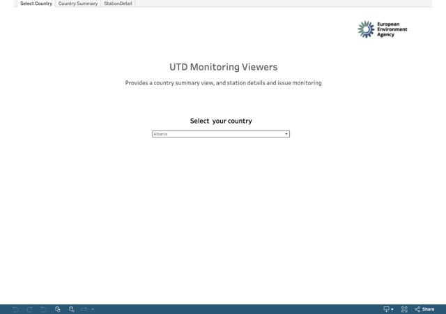

# Data flow monitors

Use these applications to follow the submission and processing of air quality data, verify calculated aggregations and review the continuity of reported time series.

## Validated data — E1a and other data flows

```{list-table}
:widths: 60 40
:class: viewer-list-table

* - ### Monitor all data flows except E2a

    Follow the processing of all air quality data flows except provisional E2a data. The viewer provides an overview of submission and processing status across the different reporting data flows.

    [**Open interactive viewer**](https://tableau-public.discomap.eea.europa.eu/views/DataMonitor_ng/General)

  - [](https://tableau-public.discomap.eea.europa.eu/views/DataMonitor_ng/General)

    *Click the image to open the interactive viewer.*

* - ### Aggregations and continuity on E1a

    Verify the aggregations calculated by the EEA from validated E1a data and review the continuity of reported time series across reporting years.

    [**Open interactive viewer**](https://tableau-public.discomap.eea.europa.eu/views/Aggregationsandcontinuity/Thesummarydashboard)

  - [](https://tableau-public.discomap.eea.europa.eu/views/Aggregationsandcontinuity/Thesummarydashboard)

    *Click the image to open the interactive viewer.*

* - ### Aggregations explorer

    The Aggregations Explorer is intended to replace the **Aggregations and continuity on E1a** viewer. It provides the same core information through a more user-friendly interface and offers greater flexibility for selecting dimensions and displaying additional features.

    [**Open interactive viewer**](https://tableau-public.discomap.eea.europa.eu/views/Aggregationexplorer/Dashboardaggregationstatus/)

  - [](https://tableau-public.discomap.eea.europa.eu/views/Aggregationexplorer/Dashboardaggregationstatus/)

    *Click the image to open the interactive viewer.*
```

## Provisional data — E2a

```{list-table}
:widths: 60 40
:class: viewer-list-table

* - ### UTD Submission Monitoring Dashboards

    This viewer combines three dashboards covering the overall status of UTD data submissions, country- and station-level details, and the EEA processing of submitted files.

    It replaces and upgrades the previous **UTD submission: general** and **UTD submission: country and station level** viewers.

    [**Open interactive viewer**](https://tableau-public.discomap.eea.europa.eu/views/AirQualityMonitoringDashboard/Home?%3Aembed=y&%3Aiid=1&%3AisGuestRedirectFromVizportal=y)

  - [](https://tableau-public.discomap.eea.europa.eu/views/AirQualityMonitoringDashboard/Home?%3Aembed=y&%3Aiid=1&%3AisGuestRedirectFromVizportal=y)

    *Click the image to open the interactive viewer.*

* - ### Monitor UTD processing

    Review detailed information on the processing of provisional E2a data, including the timelag between measurement and data availability.

    [**Open interactive viewer**](https://tableau-public.discomap.eea.europa.eu/views/UTDprocessing/MeasurementtimelagYearly)

  - [](https://tableau-public.discomap.eea.europa.eu/views/UTDprocessing/MeasurementtimelagYearly)

    *Click the image to open the interactive viewer.*
```