# Data tables

*Source: [https://aqportal.discomap.eea.europa.eu/data-tables/](https://aqportal.discomap.eea.europa.eu/data-tables/)*

**Data flows B and preliminary B**

Information on the Air Quality **Zones** reported within AQ e-Reporting.

Direct link: <https://discomap.eea.europa.eu/App/AirQualityZones/index.html>

**Data flows C and C preliminary**

Information on:

- the Air Quality Assessment **Regimes** – direct link: <https://discomap.eea.europa.eu/App/AirQualityAssessmentRegimes/index.html>
- the Air Quality Assessment **Regimes Methods** – direct link: <https://discomap.eea.europa.eu/App/AirQualityAssessmentRegimesMethods/index.html>

reported within AQ e-Reporting.

**Data** **flows D and D1b/E1b**

Information on

- the Air Quality **Measurements – stations** (data flow D) – direct link: <https://discomap.eea.europa.eu/App/AirQualityMeasurements/index.html>
- the Air Quality **Models and Objective Estimations** (data flows D1b/E1b) – direct link: <https://discomap.eea.europa.eu/App/AQViewer/index.html?fqn=Airquality_Dissem.b2g.Models>

reported within AQ e-Reporting.

Statistics based on **data flow E1a**

The **annual statistics** calculated from air quality values originating both from AirBase and AQ e-Reporting (data flow E1a).

Direct link:  <https://discomap.eea.europa.eu/App/AirQualityStatistics/index.html>

**Data flow G**

Information on

- Air Quality **Attainment status** – direct link: <https://discomap.eea.europa.eu/App/AirQualityAttainments/index.html>
- Air Quality **Assessment Methods** used for establishing Attainment status – direct link: <https://discomap.eea.europa.eu/App/AQViewer/index.html?fqn=Airquality_Dissem.b2g.AttainmentMethods>

reported within AQ e-Reporting.

**Data flow H**

Information on the Air Quality **Plans** reported within AQ e-Reporting.

Direct link: <https://discomap.eea.europa.eu/App/AirQualityPlans/index.html>

**D****ata flow I**

Information on the Air Quality **Source Apportionment** reported within AQ e-Reporting.

Direct link: <https://discomap.eea.europa.eu/App/AirQualitySourceApportionment/index.html>

**Data flow J**

Information on the Air Quality **Scenarios** reported within AQ e-Reporting.

Direct link: <https://discomap.eea.europa.eu/App/AirQualityScenarios/index.html>

**Data flow K**

Information on the Air Quality **Measures** reported within AQ e-Reporting.

Direct link: <https://discomap.eea.europa.eu/App/AirQualityMeasures/index.html>

<!-- gallery:start - generated by scripts/build_gallery.py, do not edit -->

## Viewers in this section

17 interactive applications. Each opens in a new tab; see [all viewers and dashboards](../viewers/index.md) for the full catalogue.

<a class="app-card" href="https://discomap.eea.europa.eu/App/AirQualityZones/index.html">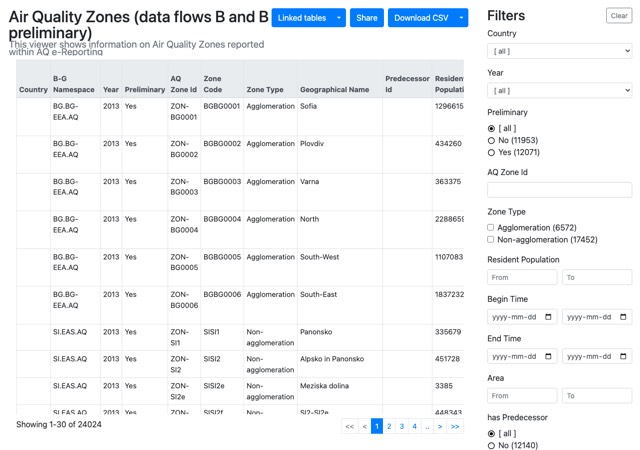Data flows B and preliminary B - zones</a>
<a class="app-card" href="https://discomap.eea.europa.eu/App/AirQualityAssessmentRegimes/index.html">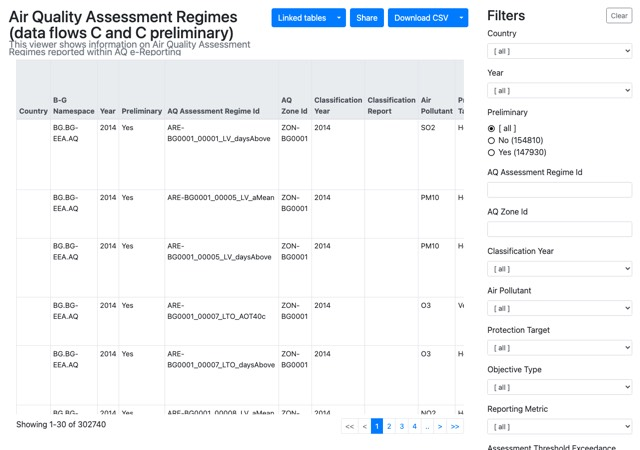Data flows C and preliminary C - assessment regime</a>
<a class="app-card" href="https://discomap.eea.europa.eu/App/AirQualityAssessmentRegimesMethods/index.html">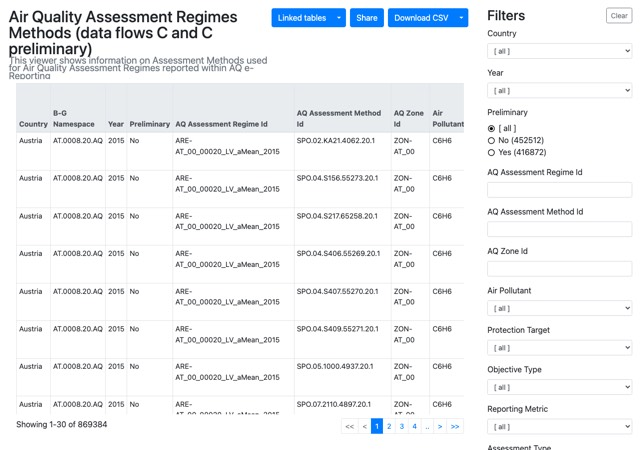Data flows C and preliminary C - assessment regimes - methods</a>
<a class="app-card" href="https://discomap.eea.europa.eu/App/AirQualityMeasurements/index.html">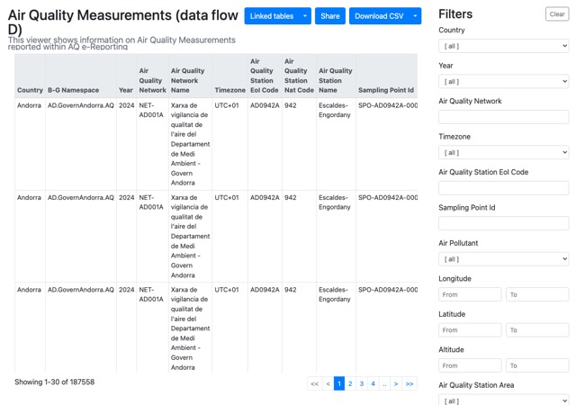Data flow D - measurement</a>
<a class="app-card" href="https://discomap.eea.europa.eu/App/AQViewer/index.html?fqn=Airquality_Dissem.b2g.Models">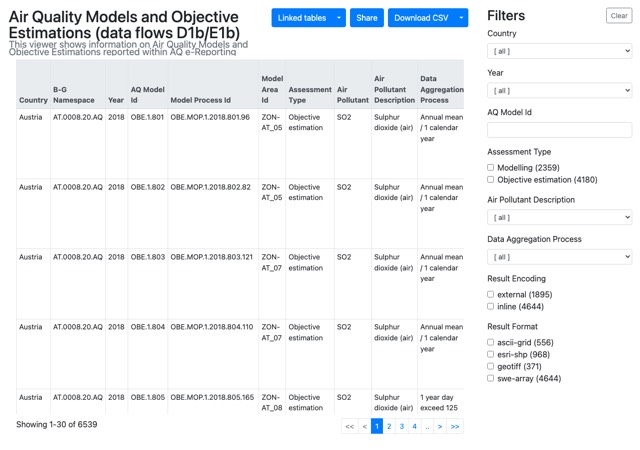Data flows D1b/E1b - models</a>
<a class="app-card" href="https://discomap.eea.europa.eu/App/AirQualityStatistics/index.html">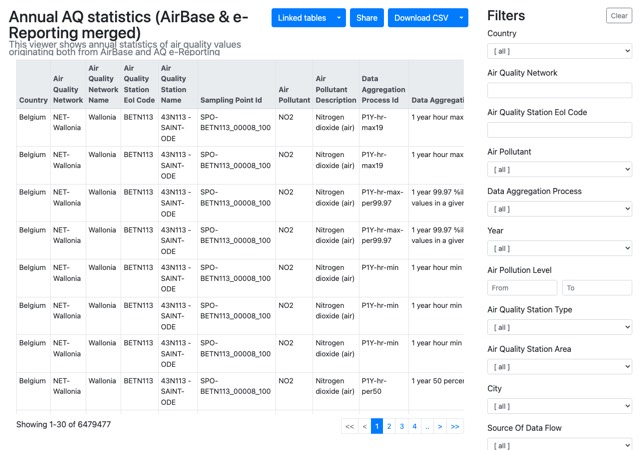Statistics based on data flow E1a - statistics table</a>
<a class="app-card" href="https://discomap.eea.europa.eu/App/AirQualityAttainments/index.html">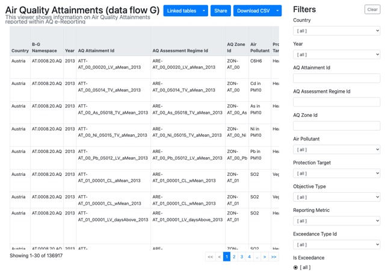Data flow G - attainment</a>
<a class="app-card" href="https://discomap.eea.europa.eu/App/AQViewer/index.html?fqn=Airquality_Dissem.b2g.AttainmentMethods">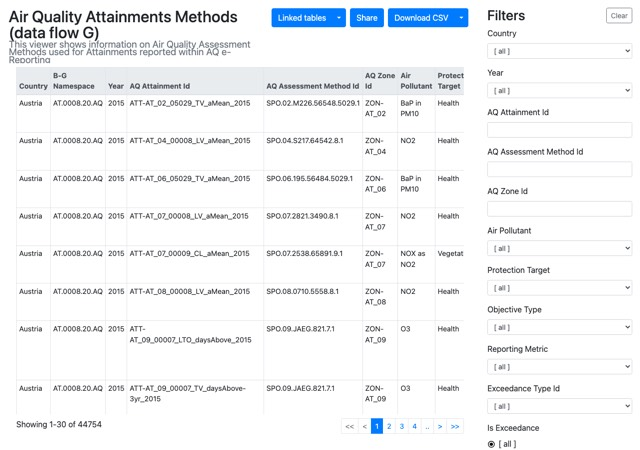Data flow G - attainment - methods</a>
<a class="app-card" href="https://discomap.eea.europa.eu/App/AirQualityPlans/index.html">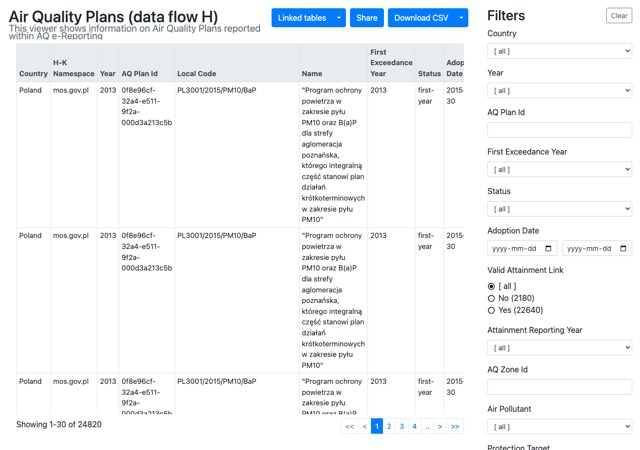Data flow H - air quality plan</a>
<a class="app-card" href="https://discomap.eea.europa.eu/App/AirQualitySourceApportionment/index.html">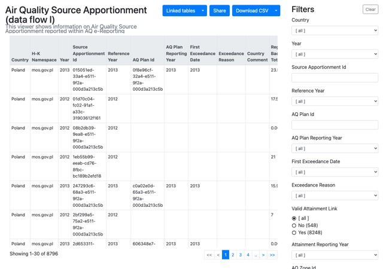Data flow I - source apportionment</a>
<a class="app-card" href="https://discomap.eea.europa.eu/App/AirQualityScenarios/index.html">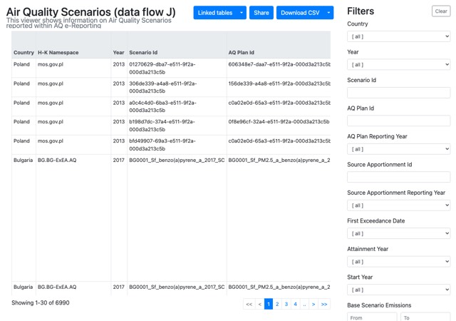Data flow J - scenarios</a>
<a class="app-card" href="https://discomap.eea.europa.eu/App/AirQualityMeasures/index.html">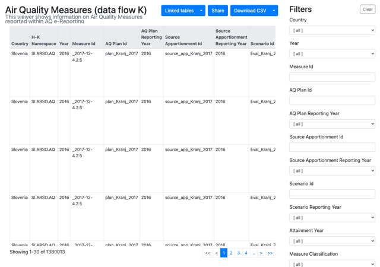Data flow K - measures</a>
<a class="app-card" href="https://discomap.eea.europa.eu/map/fme/AirQualityExportAirBase.htm">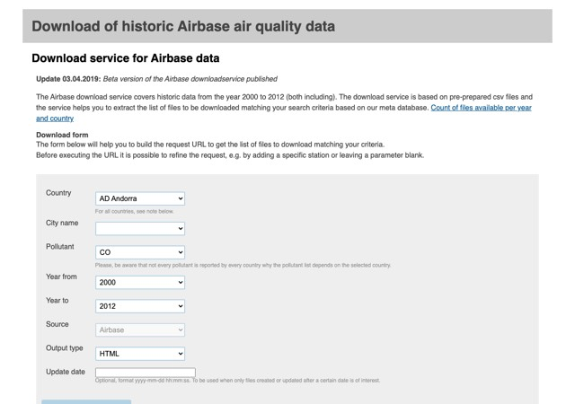Airbase (2000-2012) - discontinueddiscontinued</a>
<a class="app-card" href="https://discomap.eea.europa.eu/map/fme/AirQualityExport.htm">Not availableE1a (from 2013) - discontinueddiscontinued</a>
<a class="app-card" href="https://discomap.eea.europa.eu/map/fme/AirQualityUTDExport.htm">Not availableE2a (current year) - discontinueddiscontinued</a>
<a class="app-card" href="https://discomap.eea.europa.eu/map/FME/AQZones/">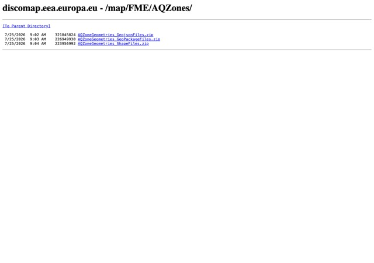Zone geometries</a>
<a class="app-card" href="https://discodata.eea.europa.eu/">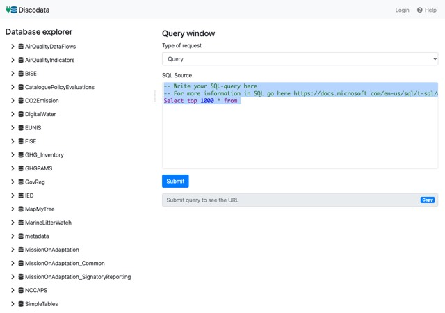DiscoData</a>

<!-- gallery:end -->
