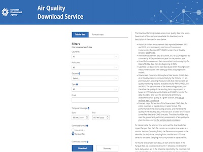

# Download data

These services provide access to air quality datasets, reference information and historical archives published by the European Environment Agency (EEA).

## Current download services

```{list-table}
:widths: 60 40
:class: viewer-list-table

* - ### Air Quality Download Service

    Download validated annual (E1a) air quality measurements together with the latest provisional (E2a/Up-To-Date) observations. The service allows filtering by country, station, pollutant and reporting period before downloading the data.

    [**Open download service**](https://eeadmz1-downloads-webapp.azurewebsites.net/)

  - [](https://eeadmz1-downloads-webapp.azurewebsites.net/)

    *Click the image to open the download service.*
```

## Reference datasets

```{list-table}
:widths: 60 40
:class: viewer-list-table

* - ### Zone geometries

    Download the official geometries of the air quality zones reported by participating countries.

    [**Open download service**](https://discomap.eea.europa.eu/map/FME/AQZones/)

  - [](https://discomap.eea.europa.eu/map/FME/AQZones/)

    *Click the image to open the download service.*

* - ### DiscoData

    Access EEA public databases through an interactive SQL interface or retrieve data programmatically using the DiscoData API.

    [**Open DiscoData**](https://discodata.eea.europa.eu/)

  - [](https://discodata.eea.europa.eu/)

    *Click the image to open DiscoData.*
```

## Legacy download services

The following services are maintained for historical purposes and are planned to be discontinued.

```{list-table}
:widths: 60 40
:class: viewer-list-table

* - ### AirBase archive (2000–2012)

    Download historical AirBase measurements covering the period 2000–2012.

    [**Open legacy download service**](https://discomap.eea.europa.eu/map/fme/AirQualityExportAirBase.htm)

  - [](https://discomap.eea.europa.eu/map/fme/AirQualityExportAirBase.htm)

    *Click the image to open the legacy download service.*

* - ### E1a archive (from 2013)

    Download archived datasets previously distributed through the E1a download service.

    [**Open legacy download service**](https://discomap.eea.europa.eu/map/fme/AirQualityExport.htm)

  - [](https://discomap.eea.europa.eu/map/fme/AirQualityExport.htm)

    *Click the image to open the legacy download service.*

* - ### E2a archive (current year)

    Download archived provisional (E2a) datasets from the former download service.

    [**Open legacy download service**](https://discomap.eea.europa.eu/map/fme/AirQualityUTDExport.htm)

  - [](https://discomap.eea.europa.eu/map/fme/AirQualityUTDExport.htm)

    *Click the image to open the legacy download service.*
```