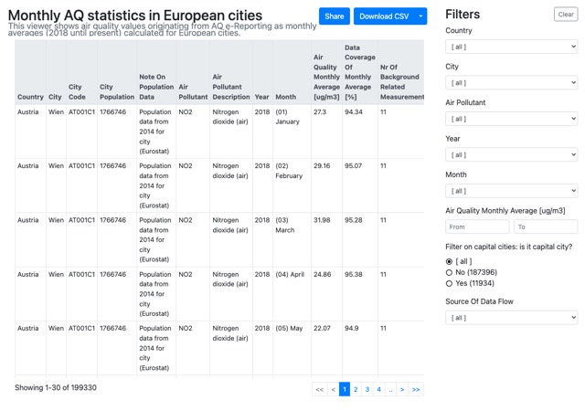
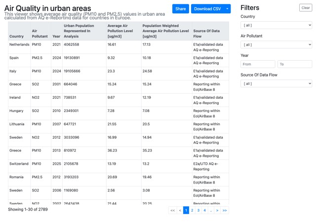
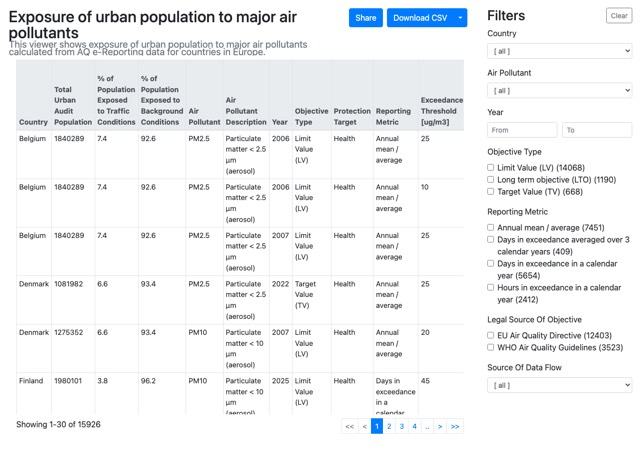
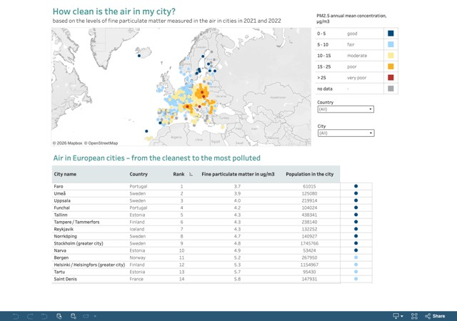

# Focus on cities

These applications provide air quality information specifically for European cities, including pollutant concentrations, population exposure and comparative assessments of urban air quality.

## Air quality in cities

```{list-table}
:widths: 60 40
:class: viewer-list-table

* - ### Monthly air quality statistics

    Explore monthly average concentrations calculated for European cities from AQ e-Reporting data (2018 onwards).

    [**Open interactive viewer**](https://discomap.eea.europa.eu/App/AQViewer/index.html?fqn=Airquality_Dissem.cities.MonthlyAirQualityStatisticsInCities)

  - [](https://discomap.eea.europa.eu/App/AQViewer/index.html?fqn=Airquality_Dissem.cities.MonthlyAirQualityStatisticsInCities)

    *Click the image to open the interactive viewer.*

* - ### Annual air quality in urban areas

    Review annual average PM₁₀ and PM₂.₅ concentrations in urban areas across European countries based on AQ e-Reporting data.

    [**Open interactive viewer**](https://discomap.eea.europa.eu/App/AQViewer/index.html?fqn=Airquality_Dissem.csi4.AirQualityInCountryUrbanAreas)

  - [](https://discomap.eea.europa.eu/App/AQViewer/index.html?fqn=Airquality_Dissem.csi4.AirQualityInCountryUrbanAreas)

    *Click the image to open the interactive viewer.*
```

## Population exposure

```{list-table}
:widths: 60 40
:class: viewer-list-table

* - ### Population exposed to air pollution

    Analyse the proportion of the urban population exposed to NO₂, O₃, PM₂.₅ and PM₁₀ concentrations above selected European air quality standards.

    [**Open interactive viewer**](https://discomap.eea.europa.eu/App/AQViewer/index.html?fqn=Airquality_Dissem.csi4.ExposureSummary)

  - [](https://discomap.eea.europa.eu/App/AQViewer/index.html?fqn=Airquality_Dissem.csi4.ExposureSummary)

    *Click the image to open the interactive viewer.*
```

## European city air quality viewer

```{list-table}
:widths: 60 40
:class: viewer-list-table

* - ### European city air quality viewer

    Compare more than 700 European cities according to long-term exposure to PM₂.₅, NO₂ and O₃. The ranking is based on population-weighted concentrations derived from high-resolution air quality maps together with concentration-response functions recommended by the World Health Organization.

    This application was previously known as the **City Ranking Viewer**.

    [**Open interactive viewer**](https://tableau-public.discomap.eea.europa.eu/views/City_AQ_Viewer_2025/EuropeanCityRanking?:device=desktop)

  - [](https://tableau-public.discomap.eea.europa.eu/views/City_AQ_Viewer_2025/EuropeanCityRanking?:device=desktop)

    *Click the image to open the interactive viewer.*
```