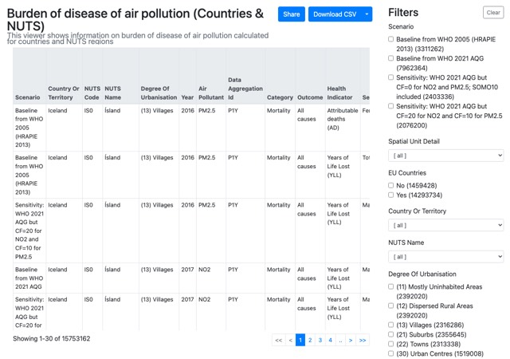
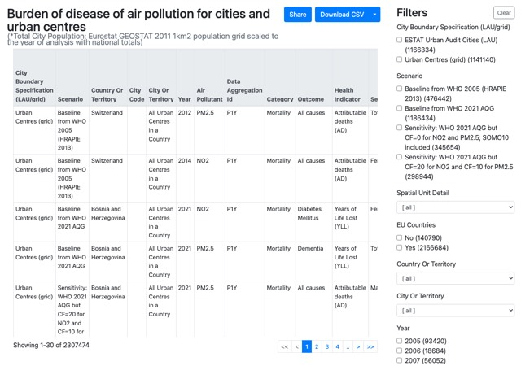

# Impact on health

These applications present the results of air quality Health Risk Assessments (HRA), including estimates of premature deaths and years of life lost under different assessment scenarios. Results are available at country, regional and city levels.

## Health Risk Assessment

```{list-table}
:widths: 60 40
:class: viewer-list-table

* - ### Country level

    Explore Health Risk Assessment results aggregated at national level, including estimates of premature deaths and years of life lost attributable to air pollution.

    [**Open interactive viewer**](https://discomap.eea.europa.eu/App/AQViewer/index.html?fqn=Airquality_Dissem.hra.countries_sel)

  - [](https://discomap.eea.europa.eu/App/AQViewer/index.html?fqn=Airquality_Dissem.hra.countries_sel)

    *Click the image to open the interactive viewer.*

* - ### NUTS 3 regional level

    Explore Health Risk Assessment results for NUTS 3 regions, allowing comparisons between regions within and across European countries.

    [**Open interactive viewer**](https://discomap.eea.europa.eu/App/AQViewer/index.html?fqn=Airquality_Dissem.hra.nuts3_sel)

  - [](https://discomap.eea.europa.eu/App/AQViewer/index.html?fqn=Airquality_Dissem.hra.nuts3_sel)

    *Click the image to open the interactive viewer.*

* - ### City level

    Explore Health Risk Assessment results for individual European cities, including estimates of the health impacts associated with long-term exposure to air pollution.

    [**Open interactive viewer**](https://discomap.eea.europa.eu/App/AQViewer/index.html?fqn=Airquality_Dissem.hra.cities_sel)

  - [](https://discomap.eea.europa.eu/App/AQViewer/index.html?fqn=Airquality_Dissem.hra.cities_sel)

    *Click the image to open the interactive viewer.*
```