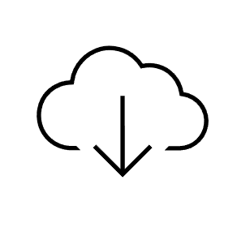
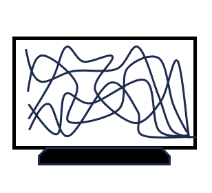
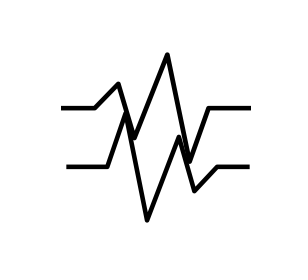
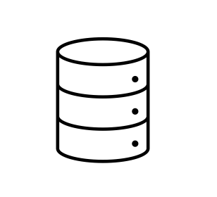
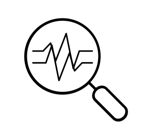

# Welcome to the AQ Portal

*Source: [https://aqportal.discomap.eea.europa.eu/](https://aqportal.discomap.eea.europa.eu/)*

***The European Air Quality (AQ) Portal*** *is a digital platform centered around the Air Quality eReporting system, a key initiative established by the* *[European Commission](https://commission.europa.eu/select-language?destination=/node/1) (EC). This system is managed and overseen by the [European Environment Agency](https://www.eea.europa.eu/en) (EEA) supported by the [European Topic Centre on Human Health and the Environment](https://www.eionet.europa.eu/etcs/etc-he) (ETC HE).*

The portal provides users with detailed technical specifications and a range of services designed to facilitate the efficient reporting of air quality data. This data is sourced from EU Member States and other participating EEA member and cooperating countries.

The platform  contains a set of interactive tools that allow users to visualize the compiled data and statistics, as well as providing an option to download them for further use or distribution. These tools are accessible via the boxes below.

For more detailed documentation, users can navigate the top menu bar. This section houses a broad spectrum of materials, from technical documents and legal frameworks to reports and briefing notes based on AQ e-Reporting data, among other relevant resources.

**Next submission deadline**: 30/09/2026

Data flows B to G – reporting on 2025 (Reportnet 2)

## [AQ eReporting](aq-ereporting.md)

Discover what is reported and when, which pollutants are measured, how they are monitored, what types of stations are used and what is the content of the system

## [Data download](download-data.md)

Download air quality data and information

## [Focus on cities](focus-on-cities.md)

Check what is happening at city level: monthly statistics, ranking, population exposed

## [Data flows monitors](data-flows-monitors.md)

Follow the data flows from their submission to final processing (data monitors)

## [Air quality now](air-quality-now.md)

Visualize the up-to-date (UTD) or near real time air quality data and consult the European Air Quality Index viewer

## [Compliance status](compliance-status.md)

Verify how the pollution levels comply with the European standards

## [Data tables](data-tables.md)

See the content of the data flows (tables). Also allowing data and information download

## [Data analysis and stats](data-analysis-and-stats.md)

Check the evolution of the pollution levels through the years (both measurement data and modelled data)

## [Impact on health](impact-on-health.md)

Get an idea on how much air pollution is affecting human health in terms of premature deaths and years of life lost

## [How to use the viewers](how-to-use-the-viewers.md)

How to use and to get the most information out of Tableau viewers?

## [Reporting year overview](reporting-year-overview.md)

Get access to simplified versions of the data monitor viewer, the statistical viewer and the compliance viewer

## [Reporter's package](reporters-package.md)

Get access to full version of the following viewers data monitor, verify statistics , statistical and compliance in one screen

## [Direct access to viewers and tables](direct-access-to-viewers-and-tables.md)

Get direct access to all the viewers included in the AQ Portal
